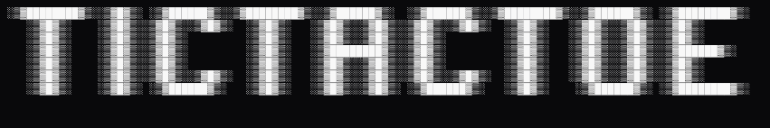
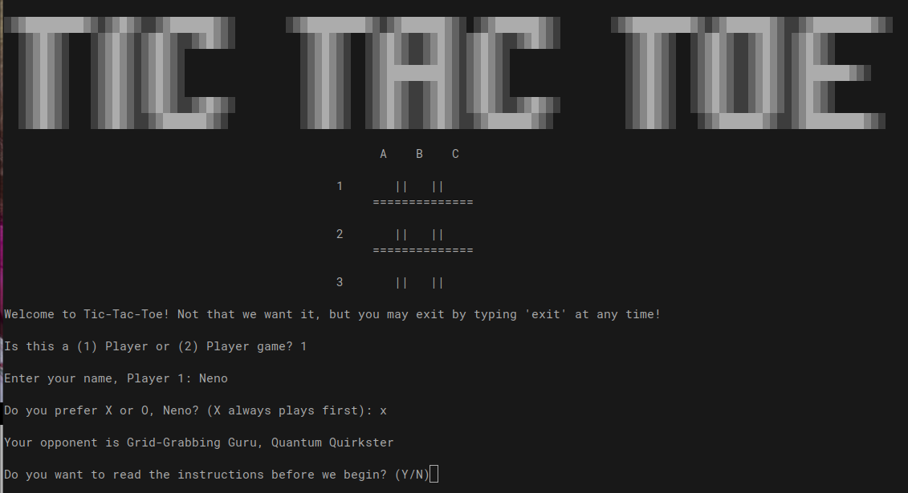
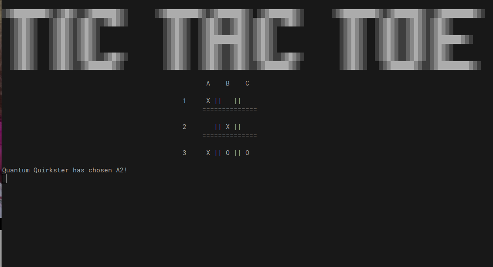
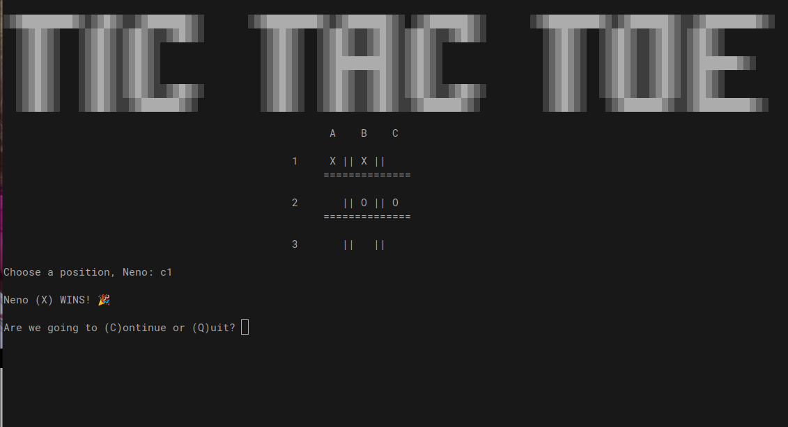

# Tic Tac Toe CLI: Dynamic Python Edition

  

A fully playable, extensible command-line Tic Tac Toe game built in pure Python. Supports 1-player mode against a random AI with quirky names (e.g., "Byte-Sized Bandit, the Diagonal Daredevil") and 2-player mode. Features dynamic board sizes (default 3x3, scalable to 4x4+), real-time updates, win/draw detection, replay loops, and smooth exits. Designed for fun, learning, and easy tweaks.

## Features
- **Dynamic Boards:** Set `board_dimensions = 4` for larger grids—positions, wins, and layout adapt automatically.
- **Player Setup:** Custom names and shapes (X/O, X starts first); AI auto-assigned with randomized epithets for personality.
- **Move Handling:** A1-style input (e.g., "B2"), duplicate prevention, and instant board refreshes with screen clears.
- **Win Detection:** Generates combos for rows, columns, and diagonals on-the-fly—no hardcoding.
- **Game Flow:** Optional tutorial, post-game recaps, replay prompts with countdown timer on quit.
- **Polish:** Centered layout, sleep delays for drama, "EXIT" anywhere, and debug-friendly prints.

## Installation
No dependencies—runs on Python 3.6+!

1. Clone the repo:
   ```
   git clone https://github.com/Demonneno/tictactoe.git
   cd tictactoe
   ```
2. Run:
   ```
   python tic_tac_toe.py
   ```

## Usage
1. **Start:** Select 1 or 2 players, enter names/shapes.
2. **Play:** Input positions like "A1" (top-left) or "C3" (bottom-right).
3. **Win:** Three-in-a-row (horizontal, vertical, diagonal).
4. **End:** Replay with "C" or quit with "Q" (dramatic timer!).
5. **Exit:** "EXIT" anytime.

Example mid-game:
```
   A    B    C 

1  X ||   ||   
  ==============

2   || O ||   
  ==============

3   ||   ||   
```
*(AI just picked "B2" after your "A1".)*

## Screenshots
  

  

## Tech Highlights
- **Dynamic Generation:** `generate_wins` uses list comprehensions for scalable combos.
- **State Management:** Globals for simplicity (board, players, moves); careful scoping with `global` in functions.
- **AI Stub:** Random empty spot picker—ready for upgrades (center priority or blocking).
- **No Externals:** Stdlib only (`random`, `sys`, `time`, `math`, `os`).

## Extending It
- **Larger Boards:** Change `board_dimensions = 4`—wins and prints auto-scale.
- **Smarter AI:** Enhance `ai_bot` with win/block checks (temp-place and `check_win`).
- **Persistence:** Uncomment `read_scores`/`save_scores` for JSON high scores.
- **Custom Wins:** Tweak `generate_wins` for shorter lines (e.g., 3-in-a-row on 5x5).

## Lessons Learned
- Globals keep scripts snappy, but OOP for complex state.
- Dynamic indexing (row-major) makes scaling trivial.
- Screen clears (`os.system`) add UX polish—test in terminals.

## Contributing
1. Fork the repo.
2. Create your feature branch (`git checkout -b feature/cool-ai`).
3. Commit (`git commit -m "Add cool AI"`).
4. Push (`git push origin feature/cool-ai`).
5. Open a Pull Request!

Issues and stars welcome!

## License
MIT License—feel free to use, modify, or distribute. See [LICENSE](LICENSE) for details.

---

*Built with ❤️ in Python. Play a game and star if it sparks joy! 🎮*
